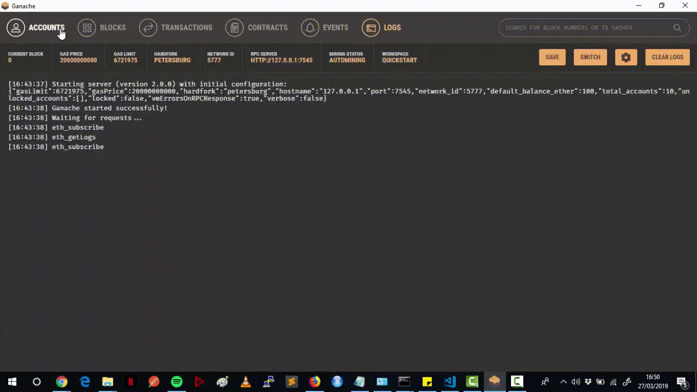

# CrowdFunding
Aplicação Web construída com Ethereum e Javascript para CrowdFunding.

## Introdução

Para executar a aplicação, siga algumas instruções abaixo:

### Prerequisites

Para a execução do projeto deve ser criado um ambiente de desenvolvimento. Primeiro passo é instalar NodeJS na máquina. Após isso, instalar as seguintes bibliotecas:
```
npm install -g truffle@4.1.15
npm install -g ganache-cli
```

### Iniciando o Ganache
A aplicação web interage com as moedas ether com base no que o Ganache já oferece. Por isso, logo após a instalação do Ganache, é necessário iniciá-lo via terminal com o comando:

```
Ganache-cli
```

### Compilação Smart Contract
No diretório contracts há o arquivo CrowdFunding.sol que é escrito em Solidity. Esse contrato precisa ser compilado e colocado em produção para que a aplicação web o acesse. Para isso execute os comandos abaixo:
```
truffle deploy
truffle migrate
```
## Execução da aplicação
Antes de executar a aplicação, é necessário instalar as dependências Javascript que nossa aplicação utiliza. Para isso, navegue ao diretório raiz do projeto e execute o comando:
```
npm install
```

Por fim, você vai estar apto a executar a aplicação web e interagir com seu Smart Contract. Basta entrar no diretório src e executar o seguinte comando:
```
npm run dev
```

Será iniciado um servidores web interno em uma determinada porta. Basta copiar o endereço, colar no navegador e realizar os testes.

Segue uma demonstração da Aplicação:


